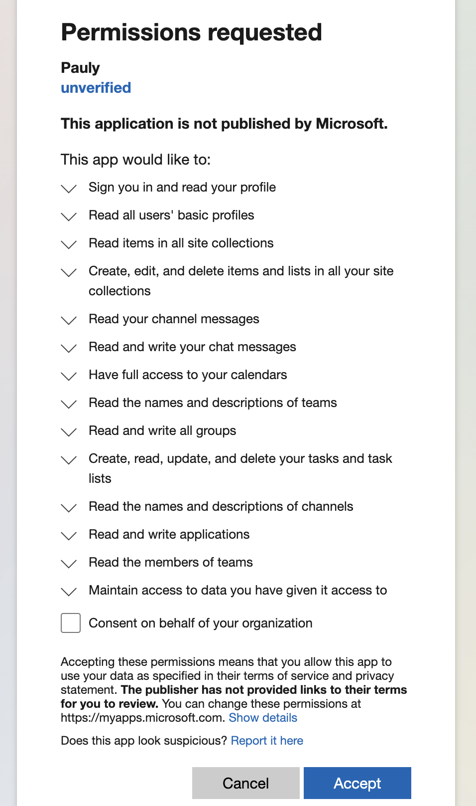

#  Pauly
Last updated October 28 2023 \
Pauly is a hub for all things school-related.
# Backend
Pauly uses Microsoft graph and SharePoint lists as a database
## Structure 
### Calendar
The calendar is organized into documents of years containing collections of months. These months are formatted as a number based on January being 1. Inside each collection documents of days are inside. Each day contains the day, month, and year. As well as the school day and schedule id. If the schedule does not have a value it is schedule one (default schedule).
### Commissions
Commissions are organized into documents that are named with their commission id. In each document, there is a
1. Start date
2. End date
3. Hidden
4. Points (what the commission is worth)
5. Selected Page (which page is shown)
6. Value (the type of commission it is)
    1. Approved by issuer
    2. Location
    3. Image
    4. Image and Location
    5. QR Code

### Notifications
The notifcations page has a board, a message, insigts (used and trending) and tasks. The tasks are from microsoft graph using the todo api. The insights are from microsoft graph the.

Refrences \
TODO: https://learn.microsoft.com/en-us/graph/api/resources/todo-overview?view=graph-rest-1.0 \
Insights (used, trending): https://learn.microsoft.com/en-us/graph/api/resources/officegraphinsights?view=graph-rest-1.0 \
Board: https://learn.microsoft.com/en-us/graph/api/driveitem-get-content-format?view=graph-rest-1.0&tabs=http


### Resources
The resource page takes teams posts and displays them. It has access to files and sections.

### Sports
This is the sports page that shows sport highlights and has team rosters.

## Format
### Colors
| name           | value     |
| -------------- | --------- |
| white          | "white"   |
| light gray     | "#ededed" |
| dark gray      | "#444444" |
| maroon         | "#793033" |
| warning orange | "#FF6700" |
### Extensions
> **NOTE**
> Extensions are automatically setup in the initialization process
```
{
    "id": "paulyEvents",
    "description": "Pauly Event Data",
    "targetTypes": [
        "Event"
    ],
    "owner": {application id},
    "properties": [
        {
            "name": "eventType",
            "type": "String"
        },
        {
            "name": "eventData",
            "type": "String"
        }
    ]
}
```

## Setup
How to setup Pauly
### Step #1

Commands to setup Azure services

```
  az login
```

https://learn.microsoft.com/en-us/cli/azure/ad/app?view=azure-cli-latest#az-ad-app-create
Save appId for use later
```
  az ad app create --display-name Pauly   
```

https://learn.microsoft.com/en-us/cli/azure/ad/signed-in-user?view=azure-cli-latest
Save userId for use later
```
  az ad signed-in-user show
```

https://learn.microsoft.com/en-us/cli/azure/ad/app/owner?view=azure-cli-latest#az-ad-app-owner-add
```
  az ad app owner add --id {appId} --owner-object-id {userId}
```

https://learn.microsoft.com/en-us/cli/azure/ad/app?view=azure-cli-latest#az-ad-app-update 
update azure ad app
```
  az rest `--method PATCH ` --uri 'https://graph.microsoft.com/v1.0/applications/{id}' `--headers 'Content-Type=application/json' ` --body "{spa:{redirectUris:['http://localhost:19006/auth']},publicClientApplication: {redirectUris: ['Pauly://auth']}, signInAudience: "AzureADMyOrg"}"
```

#### Create Static Web App

https://learn.microsoft.com/en-us/azure/static-web-apps/get-started-cli?tabs=vanilla-javascript
The resource group that you use will be tied to the web app. Some other resource group can be used but this method is preferable.
```
  az group create \
  --name Pauly-SWA \
  --location "eastus2"
```

```
  az staticwebapp create \
    --name Pauly-Static-Web-App \
    --resource-group Pauly-SWA \
    --source https://github.com/AMCanada16/Pauly.git \
    --location "eastus2" \
    --branch Static-Web-Live \
    --app-location "/web-build" \
    --output-location "build" \
    --login-with-github
```

### Create Azure Functions App and deploy functions
#### Create Function app and storage account
https://learn.microsoft.com/en-us/cli/azure/storage/account?view=azure-cli-latest#az-storage-account-create
```
  az storage account create --name paulystorage --resource-group Pauly-SWA
```

#### Create function app
https://learn.microsoft.com/en-us/cli/azure/functionapp?view=azure-cli-latest#az-functionapp-create
```
  az functionapp create --name Pauly-Functions --resource-group Pauly-SWA --storage-account paulystorage  --consumption-plan-location eastus2 --runtime node --functions-version 4
```

#### Attach to github workflow
https://learn.microsoft.com/en-us/cli/azure/functionapp/deployment/github-actions?view=azure-cli-latest

```
  az functionapp deployment github-actions add --resource-group Pauly-SWA --repo "https://github.com/AMCanada16/Pauly" --name Pauly-Functions --login-with-github --build-path "/api"
```

### Step #2
Pauly has a config file named PaulyConfig which contains three values these values need to be apart of the main config file inorder for Pauly to work.
  1. tenant id
  2. Client ID (the ID of Paulys application)
  3. org id (the id of Pauly's group)

### Setp #3 Initilize Pauly


## Graph Permissions
> **Reference**
> https://learn.microsoft.com/en-us/graph/permissions-reference

> **Why Consent Is Needed**
> https://learn.microsoft.com/en-us/graph/api/resources/consentrequests-overview?view=graph-rest-1.0

All permissions are Delegated permissions
### Users
| Permission                | Admin Consent Required | Description |
| ------------------------- | ---------------------- | ----------- |
| User.Read                 | NO                     | Allows users to sign-in to the app, and allows the app to read the profile of signed-in users. It also allows the app to read basic company information of signed-in users. |
| User.ReadBasic.All        | NO                     | Allows the app to read a basic set of profile properties of other users in your organization on behalf of the signed-in user. This includes display name, first and last name, email address, open extensions and photo. Also allows the app to read the full profile of the signed-in user. |
| People.Read.All           | YES                    | Allows the app to read a scored list of people relevant to the signed-in user or other users in the signed-in user's organization. The list can include local contacts, contacts from social networking or your organization's directory, and people from recent communications (such as email and Skype). Also allows the app to search the entire directory of the signed-in user's organization. |
| ChannelMessage.Read.All   | YES                    | Allows an app to read a channel's messages in Microsoft Teams, on behalf of the signed-in user. |
| Channel.ReadBasic.All     | NO                     | Read channel names and channel descriptions, on behalf of the signed-in user. |
| Calendars.ReadWrite       | YES                    | Allows the app to create, read, update, and delete events in user calendars. |
| Team.ReadBasic.All        | NO                     | Read the names and descriptions of teams, on behalf of the signed-in user. |
| Tasks.ReadWrite           | NO                     | Allows the app to create, read, update, and delete the signed-in user's tasks and task lists, including any shared with the user. |
| Sites.Read.All            | NO                     | Allows the app to read documents and list items in all site collections on behalf of the signed-in user. |
| Group.ReadWrite.All       | YES                    | Allows the app to create groups and read all group properties and memberships on behalf of the signed-in user. Also allows the app to read and write calendar, conversations, files, and other group content for all groups the signed-in user can access. Additionally allows group owners to manage their groups and allows group members to update group content. |

### Government
| Permission                | Admin Consent Required | Description |
| ------------------------- | ---------------------- | ----------- |
| Application.ReadWrite.All | YES                    | Allows the app to create, read, update and delete applications and service principals on behalf of the signed-in user. |
| Sites.Manage.All          | YES                    | Allows the app to manage and create lists, documents, and list items in all site collections on behalf of the signed-in user. |
| TeamMember.Read.All       | YES                    | Read the members of teams, on behalf of the signed-in user. |
